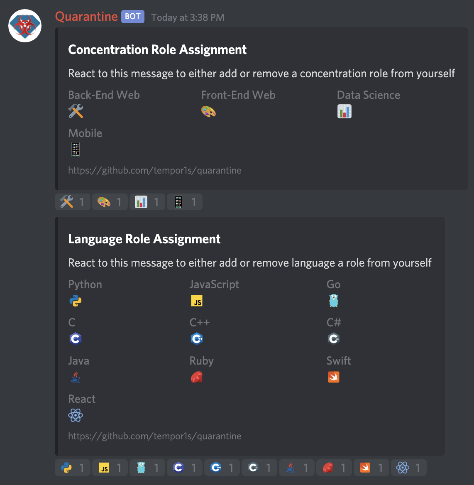
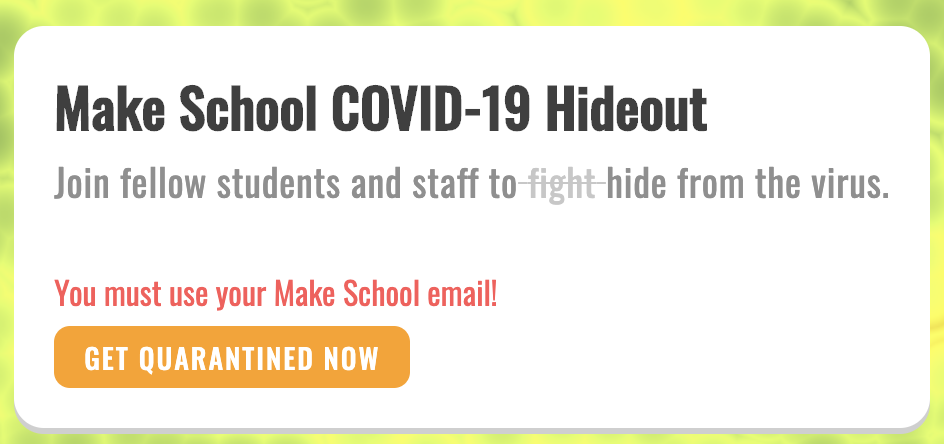
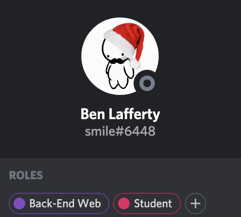
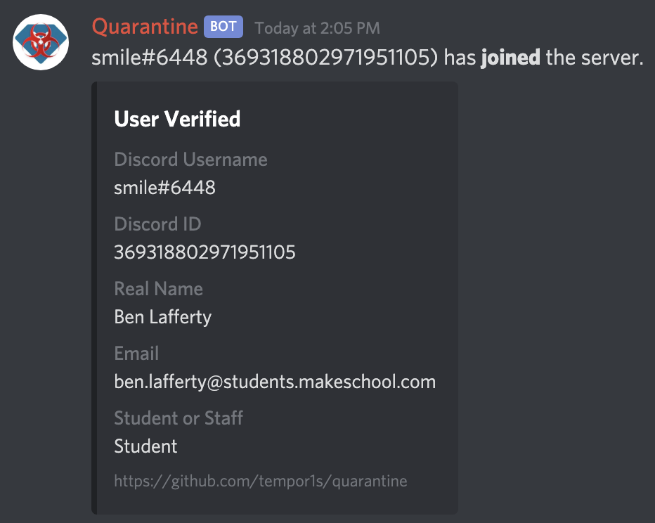

# Quarantine

Quarantine is a Discord Bot designed to manage the MS | Corvid-19 Hideout discord.

## Live Deployment

If you would like to check out the live deployment, you can check it out [here.](https://quarantine.dev.benlafferty.me)

If you are a Make School student, you can join the discord at the above link, and see the bot in action when you get verified!

## Features

The bot was designed around unique needs for the discord server.

Role Reactions - I wanted users to be able to easily assign roles with just a reaction, so staff members had very little management.



User Verification - I wanted to make sure that everyone in the discord was a student or staff member at Make School.



Automatic Role Assignment - I wanted to reduce the amount of friction for whenever a new user joined. This included assigning default roles on join such as track and if they are student/staff/



Figuring out who a Discord user is - People have very strange online aliases, so I wanted a way to easily know who a user was.



## Setup

Before you try to do any setup, please not that this bot was coded and designed for a single server, so there are a lot of hard coded
values that will make it incredibly difficult to set up for your own server. If you would like to attempt this, you will need to change values
in the files that will be listed below.

To get started, you will need to clone the repo and install all the dependencies.

```bash
# clone the repo
git clone https://github.com/tempor1s/quarantine
# cd into the cloned directory
cd quarantine
# install dependencies for the bot
yarn install / npm install
# install dependencies for the website
cd web && npm install
```

Once you have all the dependencies installed, you will want to change the values in a bunch of files.

```bash
# change values in these files
channel.util.ts
message.util.ts
user.util.ts
server.ts
# rename .env.example to .env and set all values in there
.env
```

To reiterate, this bot is not designed to be self hosted due to its nature, but I wish you luck if you try!

## Running

To get the bot running to do development or have your own version, you will need 3 terminals for 3 different commands. (Again, this bot was not designed for others to use.)

```bash
# in the first terminal, compile and build the application
tsc -w -p tsconfig.ts
# in the second terminal, run the bot
nodemon dist/index.js or node dist/index.js
# in the third terminal, run the web server
cd web && yarn start or cd web && npm start
```

Good luck getting it working for your configuration!
